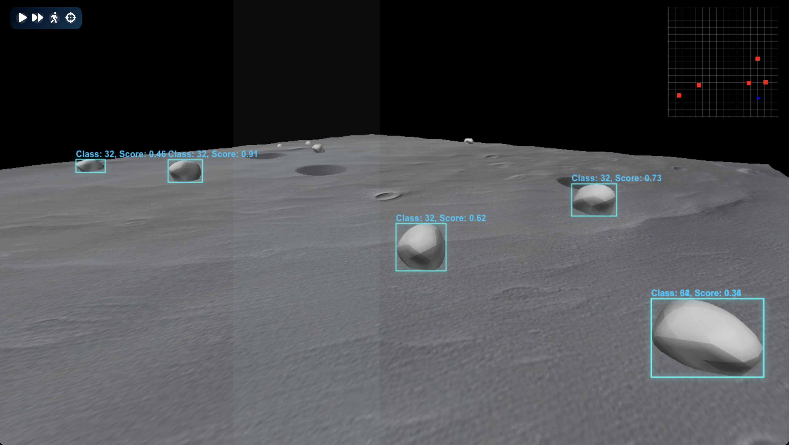

## Screenshot

## Project Overview

**3D Lunabotics Rover Simulation Tool**  
This tool simulates a lunar rover environment to program obstacle detection and navigation logic. Its primary purpose is to validate the YOLO computer vision model we have trained for the robot, which can detect rocks and holes.

### Important Goals:
- Navigation recommendations based on simulation data
- Realistic modeling of rocks and holes
- Lighting and texture realism
- Animations (the environment is kinda static so I'm not sure what to choose for this yet)

---

## Project Schedule

Based on the project's current state, I expect the following timeline:

### Week 1
- Further develop the realism of the environment.
- Import models for the background.

### Week 2
- Improve configuration and interactivity.
- Add a tool to manage waypoints (add/remove).

### Week 3
- Audit the project and improve code readability.
- Convert the project to Node.js from Python to perform more processing in the browser.

### Week 4
- Prepare the presentation.

---

## Project Technical Requirements

### Technologies:
- **WebGL** and **Three.js** for rendering.
- **OpenCV.js** for processing pixel data.
- **YOLO** for obstacle detection.
- **Node.js/JavaScript** for application logic.

---